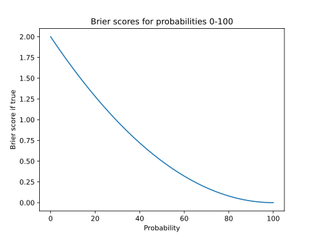

# Python Prediction Scorer

The purpose of this library is to help you compare predictions.

## Status

Python Prediction Scorer is **not ready for production use**.

## Goals

With this library, I aim to correctly implement many useful prediction scoring rules in a library that is user-friendly and easy to maintain and improve.

## Background

Some of the code in this library comes from my work at [Empiricast](https://yngve.hoiseth.net/empiricast-post-mortem/), a forecasting startup I co-founded.

For a thorough introduction to scoring rules, see [Calibration Scoring Rules for Practical Prediction Training](https://arxiv.org/abs/1808.07501v1) by [Spencer Greenberg](https://www.spencergreenberg.com/).

## Installation

`pip install predictionscorer` 

## Usage

For example, say that George and Kramer were predicting the outcome of the 2016 US presidential election. George said that Donald Trump had a 40 percent probability of winning, while Kramer put Trump's chances at 65 percent.

Considering that Trump won, Kramer's prediction was better than George's. But how much better? In order to find out, we must assign numerical scores to their predictions and compare them. That's what this library does.

There are several ways to score predictions like these. Here, we are using [Brier scores](https://www.gjopen.com/faq#faq4). Below, you can see a chart of what the Brier score would be given a range of different probabilities for the alternative that turned out to be true.



(See [plot.py](plot.py) for the code that generated this chart.)

Now, back to our election example. The following code scores the predictions.

```python
import decimal

from predictionscorer import calculators, predictions

george = predictions.Prediction(
    probabilities=(decimal.Decimal(60), decimal.Decimal(40)) # George put Clinton at 60 % and Trump at 40 %.
)
kramer = predictions.Prediction(
    probabilities=(decimal.Decimal(35), decimal.Decimal(65)) # Kramer put Clinton at 35 % and Trump at 65 %.
)

brier = calculators.Brier(
    true_alternative_index=1 # Alternative 0 is Hillary Clinton. Alternative 1 is Donald Trump.
)

print(brier.calculate(george)) # Decimal('0.72')
print(str(brier.calculate(kramer))) # '0.245'
```

As you can see, Kramer's score is _lower_ than George's. How can a better prediction give a lower score? The thing is, with Brier scores, the lower, the better. To help your intuition, you can consider a Brier score as the _distance from the truth_. (A perfect prediction yields 0, while the worst possible prediction yields 2.)

### More than two alternatives

The above example is binary — there are only two alternatives. But sometimes you need more. For example, you might want to add an "other" alternative:

```python
import decimal

from predictionscorer import calculators, predictions

prediction = predictions.Prediction(
    probabilities=(
        decimal.Decimal(55), # Clinton
        decimal.Decimal(35), # Trump
        decimal.Decimal(10), # Other
    )
)

brier = calculators.Brier(
    true_alternative_index=1,
)

print(str(brier.calculate(prediction))) # '0.735'
```

#### If the order matters

Sometimes, the ordering of alternatives matters. For example, consider the following question:

> What will the closing value of the S&P 500 stock market index be on 2019-12-31?
>
> | Index | Alternative                                  |
> |-------|----------------------------------------------|
> | 0     | Lower than 3,000.00                          |
> | 1     | Higher than 3,000.00 and lower than 3,500.00 |
> | 2     | Higher than 3,500.00 and lower than 4,000.00 |
> | 3     | Higher than 4,000.00                         |

We [now know that the answer is 3,230.78](https://us.spindices.com/indices/equity/sp-500). This means that, among our alternatives, the one with index 1 turned out to be correct. But notice that "Higher than 3,500.00 and lower than 4,000.00" (index 2) is closer to the right answer than "Higher than 4,000.00" (index 3). In such cases, the regular Brier score is a poor measure of forecasting accuracy. Instead, we use [the ordered categorical scoring rule](https://goodjudgment.io/Training/Ordered_Categorical_Scoring_Rule.pdf).

The code below should look familiar, except that we are now using the `OrderedCategorical` calculator instead of the `Brier` calculator.

```python
import decimal

from predictionscorer import calculators, predictions

prediction = predictions.Prediction(
    probabilities=(
        decimal.Decimal(25),
        decimal.Decimal(25),
        decimal.Decimal(30),
        decimal.Decimal(20),
    ),
)

ordered_categorical = calculators.OrderedCategorical(
    true_alternative_index=1,
)

print(str(ordered_categorical.calculate(prediction))) # '0.2350'
```

## Changelog

See [CHANGELOG.md](CHANGELOG.md).

## Design goals and decisions

With the design of this library, I am trying to achieve the following goals.

### Easy to read (for as many people as possible)

The code should be easy to read, even for people who don't know math or Python well. 

To achieve this, I've opted for an object-oriented design rather than, say, the array approach used by [NumPy](https://numpy.org/). The result is a more verbose and explicit API. I also try to not use advanced Python features (which many don't understand).

### Easy and predictable to use (with modern tools)

The library should be easy to use, and the results should be predictable and correct. 

To achieve this, I've made the following decisions:

- Type hints and annotations wherever possible (this also makes the code easier to read). Use a modern IDE like [PyCharm](https://www.jetbrains.com/pycharm/) and a type checker like [mypy](http://mypy-lang.org/) to benefit from this.
- The [Decimal](https://docs.python.org/3/library/decimal.html) data type rather than floats. This makes the library a bit more involved to use if you don't use decimals in your code, but you won't get unexpected return values like 3.3000000000000003.
- Assertions so the code fails early instead of producing incorrect results. For example, creating an instance of the `Prediction` class will fail if you pass it probabilities that sum to anything else than 100.
- Probabilities as percentages, not decimals. Most people think in terms of percentages — e.g. "it's 50 % likely," not "it's 0.50 likely."
- Automated tests to make sure that we get the expected results.
- Immutability where possible in order to prevent bugs.

## Contributing

Please [open an issue on GitHub](https://github.com/yhoiseth/python-prediction-scorer/issues/new) if you discover any problems or potential for improvement.

See [CONTRIBUTING.md](CONTRIBUTING.md).
