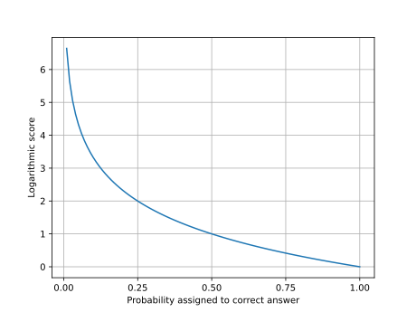
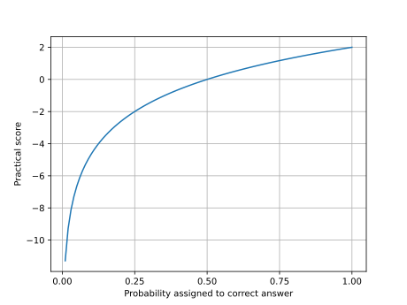

# Python Prediction Scorer

- [Python Prediction Scorer](#python-prediction-scorer)
  - [Motivation](#motivation)
  - [Status](#status)
  - [Goals](#goals)
  - [Background](#background)
  - [Installation](#installation)
    - [System requirements](#system-requirements)
  - [Usage](#usage)
    - [Choice predictions](#choice-predictions)
      - [Brier](#brier)
      - [Logarithmic](#logarithmic)
      - [Practical](#practical)
      - [Quadratic](#quadratic)
  - [Changelog](#changelog)
  - [Goals and judgment calls](#goals-and-judgment-calls)
    - [Feature complete](#feature-complete)
    - [Easy to read (for as many people as possible)](#easy-to-read-for-as-many-people-as-possible)
    - [Easy and predictable to use with modern tools](#easy-and-predictable-to-use-with-modern-tools)
  - [Contributing](#contributing)

<small><i><a href='http://ecotrust-canada.github.io/markdown-toc/'>Table of contents generated with markdown-toc</a></i></small>

## Motivation

The purpose of this library is to score predictions.

## Background

Some of the code in this library comes from my work at [Empiricast](https://yngve.hoiseth.net/empiricast-post-mortem/), a forecasting startup I co-founded.

For a thorough introduction to scoring rules, see [Calibration Scoring Rules for Practical Prediction Training](https://arxiv.org/abs/1808.07501v1) by [Spencer Greenberg](https://www.spencergreenberg.com/).

## Features

1. 4 scoring rules for choice predictions:
   1. Brier
   2. Logarithmic
   3. Practical
   4. Quadratic
2. Fully type hinted
3. 100 percent test coverage

## Installation

`pip install predictionscorer`

### System requirements

Python Prediction Scorer requires Python 3.8.

## Usage

### Choice predictions

For _choice predictions_, the forecaster assigns probabilities to different answers. As an example, let’s say that George and Kramer made the following forecasts for the result of a game where the home team ended up winning:

| Result         | George | Kramer | Correct |
| -------------- | ------ | ------ | ------- |
| Home team wins | 40 %   | 65 %   | Yes     |
| Tie            | 30 %   | 10 %   | No      |
| Away team wins | 30 %   | 25 %   | No      |

Kramer assigned a higher probability to the correct answer than George did, so his forecast was better. But how much better? In order to find out, we must _quantify the quality_ of their predictions. That’s what this library does.

We have four _scoring rules_ to determine this:

1. Brier
2. Logarithmic
3. Practical
4. Quadratic

Let us look at each of them.

#### Brier

Brier scores range from 0 to 2. Lower is better.


```python
from predictionscorer.rules import brier_score

george_probability = 0.4
kramer_probability = 0.65

george_score = brier_score(george_probability) # 0.72
kramer_score = brier_score(kramer_probability) # 0.2450
```

#### Logarithmic

Logarithmic scores range from approaching infinity (worst) to 0 (best):



```python
from predictionscorer.rules import logarithmic_score

george_probability = 0.4
kramer_probability = 0.65

george_score = logarithmic_score(george_probability) # 1.32
kramer_probability = logarithmic_score(kramer_probability) # 0.62
```

#### Practical

Practical scores range from approaching negative infinity (worst) to a configurable maximum — we use 2:



```python
from predictionscorer.rules import practical_score

george_probability = 0.4
kramer_probability = 0.65

george_score = practical_score(0.4) # -0.64
kramer_score = practical_score(0.65) # 0.76
```

`practical_score` accepts two optional parameters:

| Name                  | Default             |
| --------------------- | ------------------- |
| `max_practical_score` | `Decimal(2)`        |
| `max_probability`     | `Decimal("0.9999")` |

#### Quadratic

Quadratic scores range from -1 (worst) to 1 (best):


```python
from predictionscorer.rules import quadratic_score

george_probability = 0.4
kramer_probability = 0.65

george_score = quadratic_score(george_probability) # 0.28
kramer_score = quadratic_score(kramer_probability) # 0.76
```

## Changelog

See [CHANGELOG.md](CHANGELOG.md).

## Contributing

Please [open an issue on GitHub](https://github.com/yhoiseth/python-prediction-scorer/issues/new) if you discover any problems or potential for improvement. They are very welcome. Comments on the API design are especially useful at this point.

Also, see [CONTRIBUTING.md](CONTRIBUTING.md).
